# Document Chat - Full Stack RAG Application

A sophisticated full-stack RAG (Retrieval-Augmented Generation) system that enables intelligent document querying using local LLMs, advanced vector search, and multiple retrieval strategies. Features a modern React frontend and Electron desktop application with a powerful FastAPI backend.

## 🎥 Demo Video

[](https://youtu.be/cIJL3SNN4R4)

**Watch the full demo**: https://youtu.be/cIJL3SNN4R4

---

## 🚀 Features

### Core Capabilities
- **Multi-format Document Processing**: PDF, images, text files, CSV, JSON, XML, HTML, and code files
- **OCR Support**: Extract text from images using PaddleOCR with GPU acceleration
- **Advanced RAG**: Multiple retrieval strategies including vector search, BM25, and hybrid search
- **Local LLM Integration**: Support for llama.cpp models with configurable parameters
- **LlamaIndex Integration**: Advanced RAG capabilities with knowledge graph support
- **Cross-encoder Re-ranking**: Improve search relevance with BAAI/bge-reranker-base
- **Specialized Prompts**: Question-type specific prompt templates for better responses
- **REST API**: Complete FastAPI backend with CORS support
- **Document Evaluation**: Compare different RAG approaches and measure performance

### Frontend Features
- **Modern React Interface**: Responsive design with CSS modules
- **Real-time Chat**: Interactive messaging with typing indicators
- **Document Upload**: Drag & drop interface with progress tracking
- **Advanced Options**: Configurable RAG settings and model parameters
- **Suggested Questions**: AI-generated questions based on document content
- **Multi-format Support**: PDF, DOCX, images, text files, and more
- **Evaluation Tools**: Compare different RAG approaches
- **Connection Management**: Real-time server status monitoring

### Desktop Application
- **Cross-platform**: Built with Electron for Windows, macOS, and Linux
- **Offline Fallback**: Graceful degradation when services are unavailable
- **Native Integration**: System tray, notifications, and file associations
- **Security**: Sandboxed renderer with IPC communication

## 📋 Requirements

### Backend Dependencies
```python
# Core Framework
fastapi
uvicorn
pydantic

# Document Processing
PyPDF2 or pdfplumber
paddleocr  # For OCR
PIL (Pillow)

# Machine Learning
sentence-transformers
torch
numpy
transformers

# Vector Storage
faiss-cpu  # or faiss-gpu
langchain
langchain-community
chromadb  # Alternative vector store

# Text Processing
whoosh  # For BM25 search

# LLM Integration
llama-cpp-python
llama-index

# Re-ranking
sentence-transformers[cross-encoder]
```

### Frontend Dependencies
```json
{
  "dependencies": {
    "react": "^18.0.0",
    "react-dom": "^18.0.0",
    "react-router-dom": "^6.0.0",
    "axios": "^1.0.0",
    "uuid": "^9.0.0"
  },
  "devDependencies": {
    "@vitejs/plugin-react": "^4.0.0",
    "vite": "^4.0.0",
    "css-modules": "^0.1.0"
  }
}
```

### Electron Dependencies
```json
{
  "dependencies": {
    "electron": "^25.0.0"
  },
  "devDependencies": {
    "electron-builder": "^24.0.0"
  }
}
```

### Optional Dependencies
```python
# For advanced document processing
mammoth  # Word documents
openpyxl  # Excel files
python-docx  # Word documents

# For enhanced OCR
paddle-gpu  # GPU acceleration for PaddleOCR
```

## 🛠️ Installation

### 1. Clone and Setup
```bash
git clone <repository-url>
cd chatbot
```

### 2. Backend Setup
```bash
cd backend
python -m venv venv
source venv/bin/activate  # On Windows: venv\Scripts\activate

# Install dependencies
pip install fastapi uvicorn sentence-transformers torch numpy
pip install langchain langchain-community faiss-cpu
pip install PyPDF2 pillow whoosh paddleocr
pip install llama-cpp-python llama-index chromadb

# Create models directory and download model
mkdir models
# Download a compatible GGUF model (example)
wget https://huggingface.co/.../deepseek-r1.Q4_K_M.gguf -O models/deepseek-r1.Q4_K_M.gguf
```

### 3. Frontend Setup
```bash
cd ../frontend
npm install
# or
yarn install
```

### 4. Electron Setup (Optional)
```bash
cd ../electron
npm install
# or
yarn install
```

## ⚙️ Configuration

### Environment Variables
```bash
# Backend Configuration
export LLAMA_CPP_MODEL_PATH="./models/deepseek-r1.Q4_K_M.gguf"
export LLAMA_CTX_SIZE=2048
export LLAMA_THREADS=8
export LLAMA_GPU_LAYERS=-1  # Use all GPU layers

# Disable telemetry
export CHROMA_TELEMETRY_DISABLED=1
export TRANSFORMERS_NO_TF=1

# Frontend Configuration (optional)
export REACT_APP_BACKEND_URL=http://localhost:8000
```

### Storage Directories
The application creates these directories automatically:
- `~/Library/Application Support/Document Chat/uploads/` - Uploaded documents
- `~/Library/Application Support/Document Chat/faiss_db/` - FAISS vector index
- `~/Library/Application Support/Document Chat/bm25_index/` - BM25 text index
- `~/Library/Application Support/Document Chat/evaluation/` - Evaluation results

## 🚀 Usage

### Development Mode

#### 1. Start Backend Server
```bash
cd backend
python app_integration_updated.py --port 8000 --host 127.0.0.1
```

#### 2. Start Frontend Development Server
```bash
cd frontend
npm start
# or
yarn start
```

#### 3. Start Electron Desktop App (Optional)
```bash
cd electron
npm start
# or
yarn start
```

### Production Deployment

#### Backend
```bash
# Production server with gunicorn
gunicorn app_integration_updated:app -w 4 -k uvicorn.workers.UvicornWorker

# Or direct uvicorn
uvicorn app_integration_updated:app --host 0.0.0.0 --port 8000 --workers 4
```

#### Frontend
```bash
# Build for production
npm run build
# or
yarn build

# Serve built files
npx serve -s dist
```

#### Electron
```bash
# Build desktop application
npm run build
# or
yarn build

# Create installer
npm run dist
```

### Frontend Interface

#### Document Upload
1. **Drag & Drop**: Drag files directly onto the upload area
2. **Click to Browse**: Click the upload area to select files
3. **Progress Tracking**: Real-time upload progress with percentage
4. **Format Support**: PDF, DOCX, TXT, CSV, XLSX, JPG, PNG (Max 20MB)

#### Chat Interface
1. **Real-time Messaging**: Interactive chat with your documents
2. **Suggested Questions**: AI-generated questions based on document content
3. **Message History**: Persistent conversation history
4. **Typing Indicators**: Visual feedback during processing

#### Advanced Settings
- **Model Selection**: Choose from available LLM models
- **Temperature Control**: Adjust response creativity (0-1 scale)
- **RAG Options**: Toggle LlamaIndex and Advanced RAG features
- **Context Window**: Configure number of relevant chunks (1-10)

#### Evaluation Tools
- **RAG Comparison**: Compare different retrieval strategies
- **Performance Metrics**: Analyze response quality and relevance
- **System Insights**: View which RAG system generated responses

## 📡 API Reference

### Backend Endpoints
#### Document Management
```http
POST /upload
Content-Type: multipart/form-data
# Upload document with optional RAG settings
FormData: {
  file: [File],
  use_advanced_rag: boolean,
  use_llama_index: boolean
}

GET /documents
# Get list of all uploaded documents

POST /set_document
Content-Type: application/json
{
  "document": "filename.pdf"
}
# Set current active document for queries

GET /suggestions?document=filename.pdf
# Get AI-generated suggested questions for document
```

#### Frontend-Backend Communication
The React frontend communicates with the backend using Axios:

```javascript
// Example: Upload document
const uploadDocument = async (file, options) => {
  const formData = new FormData();
  formData.append('file', file);
  formData.append('use_advanced_rag', options.use_advanced_rag);
  formData.append('use_llama_index', options.use_llama_index);
  
  const response = await axios.post(`${backendURL}/upload`, formData, {
    headers: { 'Content-Type': 'multipart/form-data' },
    onUploadProgress: (progressEvent) => {
      const progress = Math.round(
        (progressEvent.loaded * 100) / progressEvent.total
      );
      setUploadProgress(progress);
    }
  });
  
  return response.data;
};

// Example: Query document
const queryDocument = async (query, options) => {
  const response = await axios.post(`${backendURL}/query-sync`, {
    query,
    document: options.document,
    model: options.model,
    temperature: options.temperature,
    context_window: options.context_window,
    use_llama_index: options.use_llama_index
  });
  
  return response.data;
};
```
### Desktop Application Features

The Electron wrapper provides:

#### Native Desktop Integration
- **System Tray**: Background operation with tray icon
- **File Associations**: Open supported documents directly
- **Notifications**: System notifications for processing completion
- **Auto-updater**: Seamless application updates

#### Fallback System
- **Offline Mode**: `fallback.html` when backend is unavailable
- **Loading States**: `loading.html` and `splash.html` for startup
- **Error Handling**: Graceful degradation with manual upload options

#### Security Features
- **Sandboxed Renderer**: Secure execution environment
- **IPC Communication**: Safe inter-process communication via `preload.cjs`
- **Content Security Policy**: Protection against XSS attacks

```javascript
// Electron IPC example (preload.cjs)
contextBridge.exposeInMainWorld('api', {
  send: (channel, data) => {
    if (['toMain'].includes(channel)) {
      ipcRenderer.send(channel, data);
    }
  },
  receive: (channel, func) => {
    if (['fromMain'].includes(channel)) {
      ipcRenderer.on(channel, (event, ...args) => func(...args));
    }
  }
});
```

## 🎨 Frontend Architecture

### Component Structure
```
frontend/src/
├── pages/
│   └── documents/
│       └── MCPDocumentChat.jsx    # Main chat interface
├── styles/
│   └── pages/
│       └── MCPDocumentChat.css    # Component styles
├── api/
│   └── baseURL.js                 # Backend URL configuration
└── App.jsx                        # Main application component
```

### Key Frontend Features

#### State Management
```javascript
// Document and upload state
const [file, setFile] = useState(null);
const [uploading, setUploading] = useState(false);
const [uploadResult, setUploadResult] = useState(null);

// Chat state
const [messages, setMessages] = useState([]);
const [input, setInput] = useState('');
const [loading, setLoading] = useState(false);

// Configuration state
const [advancedOptions, setAdvancedOptions] = useState({
  use_advanced_rag: true,
  use_llama_index: true,
  model: "deepseek-r1",
  temperature: 0.3,
  context_window: 5
});
```

#### Real-time Features
- **Connection Status**: Live server connectivity monitoring
- **Upload Progress**: Real-time file upload progress tracking
- **Typing Indicators**: Visual feedback during LLM processing
- **Auto-scroll**: Automatic scrolling to latest messages
- **Suggested Questions**: Dynamic question generation

#### Responsive Design
- **Mobile-first**: Optimized for all screen sizes
- **Drag & Drop**: Intuitive file upload interface
- **Keyboard Shortcuts**: Enter to send, Shift+Enter for newlines
- **Accessibility**: ARIA labels and semantic HTML

### Electron Application Structure
```
electron/
├── main.js                # Main Electron process
├── preload.cjs           # Secure IPC bridge
├── renderer.js           # Renderer process utilities
├── package.json          # Electron dependencies
├── Modelfile            # Model configuration
├── fallback.html        # Offline fallback page
├── loading.html         # Loading screen
└── splash.html          # Startup splash screen
```

#### Application Lifecycle
1. **Startup**: Display splash screen with loading status
2. **Initialization**: Start backend services and check connectivity
3. **Main Window**: Load React frontend or fallback page
4. **Runtime**: Handle IPC communication and system integration
5. **Shutdown**: Clean shutdown of all processes

## 🏗️ System Architecture

### Architecture Overview


### Data Flow Architecture


### Full Stack Components

#### Backend Components (`chatbot/backend/`)
- **FastAPI Application** (`app_integration_updated.py`) - Main server with REST API
- **Document Processor** (`document_processor_patched.py`) - Multi-format document processing
- **Vector Storage** (`vector_store.py`) - FAISS-based vector search with hybrid capabilities
- **LLM Integration** (`improved_prompt_template.py`) - Specialized prompt templates
- **RAG Systems** - Multiple retrieval strategies with evaluation

#### Frontend Components (`chatbot/frontend/`)
- **React Application** - Modern responsive web interface
- **MCPDocumentChat Component** (`src/pages/documents/MCPDocumentChat.jsx`) - Main chat interface
- **Real-time Communication** - Axios-based API integration
- **File Upload** - Drag & drop document upload with progress tracking
- **Chat Interface** - Interactive messaging with suggested questions

### Technology Stack Overview

```mermaid
graph LR
    subgraph "Frontend Technologies"
        React[React 18]
        Vite[Vite Build Tool]
        Axios[Axios HTTP Client]
        CSS[CSS Modules]
    end
    
    subgraph "Desktop Technologies"
        Electron[Electron Framework]
        Node[Node.js Runtime]
        IPC[IPC Communication]
    end
    
    subgraph "Backend Technologies"
        FastAPI[FastAPI Framework]
        Python[Python 3.8+]
        Uvicorn[Uvicorn Server]
        Pydantic[Pydantic Validation]
    end
    
    subgraph "AI/ML Technologies"
        Transformers[🤗 Transformers]
        FAISS[FAISS Vector DB]
        LlamaIndex[LlamaIndex RAG]
        LlamaCpp[llama.cpp]
        PaddleOCR[PaddleOCR]
        CrossEncoder[Cross-Encoder]
    end
    
    subgraph "Storage Technologies"
        FileSystem[Local File System]
        VectorIndex[Vector Indexes]
        BM25Index[BM25 Text Index]
    end
    
    React --> FastAPI
    Electron --> React
    FastAPI --> Transformers
    FastAPI --> FAISS
    FastAPI --> LlamaIndex
    FastAPI --> LlamaCpp
    FastAPI --> PaddleOCR
    FAISS --> VectorIndex
    LlamaIndex --> FileSystem
    
    classDef frontend fill:#61dafb,color:#000
    classDef desktop fill:#47848f,color:#fff
    classDef backend fill:#009688,color:#fff
    classDef ai fill:#ff6f00,color:#fff
    classDef storage fill:#4caf50,color:#fff
    
    class React,Vite,Axios,CSS frontend
    class Electron,Node,IPC desktop
    class FastAPI,Python,Uvicorn,Pydantic backend
    class Transformers,FAISS,LlamaIndex,LlamaCpp,PaddleOCR,CrossEncoder ai
    class FileSystem,VectorIndex,BM25Index storage
```


- **Electron Wrapper** - Native desktop application
- **Fallback Pages** - Offline support and error handling
- **Loading States** - Splash screen and status updates
- **IPC Communication** - Secure renderer-main process communication

#### 1. FastAPI Backend (`app_integration_updated.py`)
- **Request Handling**: Multi-threaded request processing
- **File Management**: Secure upload and storage
- **Model Integration**: LLM and embedding model management
- **Error Handling**: Comprehensive error management with logging
- **CORS Support**: Cross-origin resource sharing for web clients

#### 2. Document Processor (`document_processor_patched.py`)
- **Multi-format Support**: PDF, images, text, and code files
- **OCR Integration**: PaddleOCR with GPU acceleration
- **Intelligent Chunking**: Context-aware text splitting
- **Content Validation**: Binary data filtering and sanitization
- **Embedding Generation**: Vector representation creation

#### 3. Vector Storage Systems
- **FAISS Backend** (`vector_store.py`): High-performance similarity search
- **ChromaDB Alternative** (`vector_store_patched.py`): Alternative vector database
- **Hybrid Search**: Combines vector similarity and BM25 keyword search
- **Persistent Storage**: Cross-session data persistence
- **Metadata Handling**: Document source and chunk tracking

#### 4. Frontend Components
- **React Interface**: Modern, responsive web application
- **Real-time Communication**: WebSocket-like experience with HTTP
- **State Management**: Efficient local state with React hooks
- **Error Boundaries**: Graceful error handling and recovery

#### 5. Desktop Integration
- **Electron Wrapper**: Cross-platform desktop application
- **System Integration**: File associations and notifications
- **Offline Support**: Graceful degradation when backend unavailable
- **Security Sandbox**: Isolated renderer process execution

### Search Strategy

#### Vector Search Pipeline
1. **Text Preprocessing**: Clean and normalize input text
2. **Embedding Generation**: Convert text to high-dimensional vectors
3. **Similarity Search**: Find most relevant document chunks
4. **Re-ranking**: Use cross-encoder to improve relevance ordering
5. **Context Assembly**: Build focused context for LLM

#### Hybrid Search Approach
```python
# Combines multiple search methods
vector_results = vector_search(query, k=5)
bm25_results = bm25_search(query, k=5)
combined_results = deduplicate_and_merge(vector_results, bm25_results)
reranked_results = cross_encoder_rerank(query, combined_results)
```

## 🔧 Advanced Configuration

### Model Selection
The system supports various model types:
- **Small models**: For fast responses (e.g., Mamba-790M)
- **Large models**: For better quality (e.g., Llama-7B, Mistral-7B)
- **Specialized models**: Domain-specific fine-tuned models

### RAG Strategies
1. **Default RAG**: Basic vector search with simple prompts
2. **Advanced RAG**: Hybrid search with re-ranking
3. **LlamaIndex RAG**: Knowledge graph-enhanced retrieval

### Prompt Engineering
The system includes specialized prompts for:
- **Factoid questions**: Direct fact extraction
- **Multi-hop reasoning**: Connecting information across chunks
- **Unanswerable detection**: Identifying insufficient context
- **Reasoning tasks**: Logical inference from provided information

## 📊 Performance Optimization

### Memory Management
- **Chunking strategies**: Optimize chunk size for your use case
- **Context windows**: Balance between context richness and processing speed
- **Model quantization**: Use 4-bit or 8-bit quantization for faster inference

### Search Optimization
```python
# Recommended settings for different use cases

# Fast responses (lower quality)
{
    "context_window": 3,
    "temperature": 0.1,
    "quantization": "4bit",
    "use_llama_index": False
}

# High quality (slower)
{
    "context_window": 8,
    "temperature": 0.3,
    "quantization": "None",
    "use_llama_index": True
}
```

## 🧪 Testing and Development

### Frontend Development
```bash
# Start development server with hot reload
cd frontend
npm run dev

# Run tests
npm test

# Lint and format code
npm run lint
npm run format

# Build for production
npm run build
```

### Backend Development
```bash
# Start backend with auto-reload
cd backend
uvicorn app_integration_updated:app --reload --port 8000

# Run tests
python -m pytest tests/

# Code formatting
black .
isort .
```

### Electron Development
```bash
# Start in development mode
cd electron
npm run electron-dev

# Package for distribution
npm run electron-pack

# Build installers
npm run dist
```

### Integration Testing
```bash
# Test full stack integration
npm run test:integration

# Test API endpoints
npm run test:api

# Test Electron application
npm run test:electron
```

### Evaluation and Quality Assurance
#### Built-in RAG Evaluation
The system includes comprehensive evaluation tools accessible through both the API and frontend:

```javascript
// Frontend evaluation trigger
const handleEvaluateRAG = async () => {
  const response = await axios.post(`${backendURL}/evaluate/basic`, {
    document: uploadResult.filename,
    query: "What is the main topic of this document?"
  });
  
  // Compare original RAG vs LlamaIndex RAG
  const evaluation = response.data.evaluation;
  console.log('Original RAG:', evaluation.original.response);
  console.log('LlamaIndex RAG:', evaluation.llama_index.response);
};
```

#### Performance Metrics
- **Response Quality**: Semantic similarity to expected answers
- **Retrieval Accuracy**: Relevance of retrieved document chunks
- **Processing Speed**: Time to generate responses
- **System Resource Usage**: Memory and CPU utilization

### Custom Evaluation
You can implement custom evaluation metrics:
```python
def custom_evaluation(queries, expected_answers):
    results = []
    for query, expected in zip(queries, expected_answers):
        response = query_system(query)
        score = calculate_similarity(response, expected)
        results.append({"query": query, "score": score})
    return results
```

## 🐛 Troubleshooting

### Common Issues

#### 1. Frontend Connection Issues
```bash
# Check if backend is running
curl http://localhost:8000/

# Verify CORS configuration
# Check browser network tab for CORS errors

# Frontend won't connect to backend
# Update baseURL in frontend/src/api/baseURL.js
export const getBackendURL = () => {
  return process.env.REACT_APP_BACKEND_URL || 'http://localhost:8000';
};
```

#### 2. Electron Application Issues
```bash
# Electron won't start
# Check if all dependencies are installed
cd electron && npm install

# Fallback page showing
# Verify backend is running and accessible
# Check electron main process logs

# IPC communication errors
# Verify preload.cjs is properly configured
# Check contextBridge security settings
```

#### 3. Upload/Processing Issues
```bash
# File upload fails
# Check file size limits (20MB default)
# Verify supported file formats
# Check backend storage permissions

# OCR processing fails
# Install PaddleOCR dependencies
pip install paddlepaddle paddleocr
# For GPU support: pip install paddlepaddle-gpu
```

#### 4. Model Loading Failures
```bash
# Check model path and format
ls -la ./models/
file ./models/deepseek-r1.Q4_K_M.gguf

# Verify model compatibility
# Ensure GGUF format for llama.cpp
# Check model file isn't corrupted

# Memory issues with large models
# Use quantized models (Q4_K_M, Q8_0)
# Reduce context window size
# Enable model offloading to GPU
```

#### 5. Search Quality Issues
```bash
# Poor search results
# Increase context_window for more context
# Enable cross-encoder re-ranking
# Try hybrid search instead of pure vector search

# Documents not being found
# Check if document was properly indexed
# Verify vector store initialization
# Test with simpler queries first
```

### Development Debugging

#### Frontend Debugging
```javascript
// Enable debug logging
localStorage.setItem('debug', 'chatbot:*');

// Check React DevTools
// Monitor network requests in browser DevTools
// Check console for JavaScript errors

// Test API endpoints directly
const testAPI = async () => {
  try {
    const response = await fetch('http://localhost:8000/');
    console.log('Backend status:', await response.json());
  } catch (error) {
    console.error('Backend connection failed:', error);
  }
};
```

#### Backend Debugging
```python
# Enable detailed logging
import logging
logging.basicConfig(level=logging.DEBUG)

# Test vector store directly
vector_store.similarity_search_with_debug(query, k=5)

# Check document processing
chunks = process_and_index_file("path/to/document.pdf")
print(f"Processed {len(chunks)} chunks")
``` ## 🔒 Security Considerations

### Frontend Security
- **Input Sanitization**: All user inputs are validated and sanitized
- **XSS Protection**: React's built-in XSS protection mechanisms
- **CSRF Protection**: CORS configuration prevents unauthorized requests
- **File Upload Validation**: Strict file type and size limits
- **Secure Communication**: HTTPS in production environments

### Backend Security
- **File Upload Security**: 
  - File type validation and sanitization
  - Size limits to prevent DoS attacks
  - Secure file storage with proper permissions
  - Path traversal protection
- **Input Validation**: Comprehensive request validation with Pydantic
- **Rate Limiting**: Protection against API abuse
- **Error Handling**: Secure error messages without sensitive information

### Electron Security
- **Context Isolation**: Renderer processes run in isolated contexts
- **Node Integration**: Disabled in renderer for security
- **Preload Scripts**: Secure IPC communication via contextBridge
- **Content Security Policy**: Strict CSP headers
- **Sandboxing**: Renderer processes run in sandboxed environment

```javascript
// Secure IPC communication example
// preload.cjs
const { contextBridge, ipcRenderer } = require('electron');

contextBridge.exposeInMainWorld('api', {
  // Whitelist specific channels only
  send: (channel, data) => {
    const validChannels = ['toMain'];
    if (validChannels.includes(channel)) {
      ipcRenderer.send(channel, data);
    }
  },
  receive: (channel, func) => {
    const validChannels = ['fromMain'];
    if (validChannels.includes(channel)) {
      ipcRenderer.on(channel, (event, ...args) => func(...args));
    }
  }
});
```

## 🤝 Contributing

### Development Workflow
1. **Fork the repository** and create a feature branch
2. **Install dependencies** for all components (backend, frontend, electron)
3. **Make changes** following the coding standards
4. **Test thoroughly** across all components
5. **Submit a pull request** with detailed description

### Code Standards

#### Backend (Python)
```bash
# Use Black for formatting
black . --line-length 88

# Use isort for import organization
isort . --profile black

# Type hints for function signatures
def process_document(file_path: str) -> Tuple[List[Document], List[str]]:
    pass

# Comprehensive docstrings
def query_index(query: str, top_k: int = 5) -> List[Document]:
    """
    Search for relevant document chunks.
    
    Args:
        query: Search query string
        top_k: Number of results to return
        
    Returns:
        List of relevant document chunks
    """
```

#### Frontend (JavaScript/React)
```javascript
// Use ESLint and Prettier
npm run lint
npm run format

// Functional components with hooks
const MCPDocumentChat = ({ onError = () => {} }) => {
  const [state, setState] = useState(initialState);
  
  // Clear prop-types or TypeScript for type safety
  useEffect(() => {
    // Cleanup functions for subscriptions
    return () => cleanup();
  }, [dependencies]);
};

// Consistent naming conventions
const handleFileUpload = async (file) => {
  // Implementation
};
```

### Adding New Features

#### 1. Document Processors
```python
# Add new file format support in document_processor_patched.py
def process_new_format(file_path: str) -> str:
    """Process a new document format."""
    try:
        import new_library
        # Implementation
        return extracted_text
    except ImportError:
        logger.warning("Library not available for new format")
        return create_fallback_document(file_path)
```

#### 2. Search Methods
```python
# Implement alternative retrieval in vector_store.py
class CustomVectorStore(VectorStore):
    def semantic_search(self, query: str, k: int = 5) -> List[Document]:
        """Custom semantic search implementation."""
        # Implementation
        return results
```

#### 3. LLM Integrations
```python
# Add new model support in improved_prompt_template.py
def custom_llm_response(llm, query: str, context: str, **kwargs) -> str:
    """Integration with a new LLM API."""
    # Implementation
    return response
```

#### 4. Frontend Components
```javascript
// Add new React components in frontend/src/components/
const NewFeatureComponent = ({ data, onAction }) => {
  return (
    <div className="new-feature">
      {/* Implementation */}
    </div>
  );
};

export default NewFeatureComponent;
```

### Testing Guidelines

#### Unit Tests
```python
# Backend tests with pytest
def test_document_processing():
    result = process_and_index_file("test_document.pdf")
    assert len(result[0]) > 0  # chunks
    assert len(result[1]) > 0  # questions

def test_vector_search():
    vector_store = VectorStore()
    results = vector_store.search("test query")
    assert isinstance(results, list)
```

```javascript
// Frontend tests with Jest/React Testing Library
import { render, screen, fireEvent } from '@testing-library/react';
import MCPDocumentChat from './MCPDocumentChat';

test('uploads document successfully', async () => {
  render(<MCPDocumentChat />);
  const fileInput = screen.getByLabelText(/upload/i);
  
  fireEvent.change(fileInput, {
    target: { files: [new File(['content'], 'test.pdf', { type: 'application/pdf' })] }
  });
  
  expect(screen.getByText('test.pdf')).toBeInTheDocument();
});
```

#### Integration Tests
```python
# Test full pipeline
def test_full_document_pipeline():
    # Upload document
    upload_response = client.post("/upload", files={"file": test_file})
    assert upload_response.status_code == 200
    
    # Query document
    query_response = client.post("/query-sync", json={"query": "test"})
    assert query_response.status_code == 200
    assert "response" in query_response.json()
```

## 📈 Roadmap

### Planned Features

#### Short Term (1-3 months)
- [ ] **Streaming Responses**: Real-time response generation
- [ ] **Multi-language Support**: International language processing
- [ ] **Advanced File Formats**: PowerPoint, Excel macro support
- [ ] **Better Mobile Experience**: Responsive design improvements
- [ ] **Keyboard Shortcuts**: Power user features

#### Medium Term (3-6 months)
- [ ] **User Authentication**: Multi-user support with sessions
- [ ] **Document Versioning**: Track document changes over time
- [ ] **Collaborative Features**: Share documents and conversations
- [ ] **Advanced Analytics**: Usage metrics and performance insights
- [ ] **Plugin System**: Extensible architecture for custom features

#### Long Term (6+ months)
- [ ] **Cloud Integration**: Support for cloud storage providers
- [ ] **Real-time Collaboration**: Multi-user document editing
- [ ] **Advanced Knowledge Graphs**: Visual document relationships
- [ ] **API Marketplace**: Third-party integrations
- [ ] **Enterprise Features**: SSO, audit logs, compliance tools

### Performance Improvements
- [ ] **Async Processing**: Non-blocking document processing
- [ ] **Caching Layer**: Redis-based response caching
- [ ] **Database Backend**: PostgreSQL for metadata storage
- [ ] **Microservices**: Scalable service architecture
- [ ] **Container Deployment**: Docker and Kubernetes support

### Quality Enhancements
- [ ] **Automated Testing**: CI/CD pipeline with comprehensive tests
- [ ] **Error Monitoring**: Sentry integration for error tracking
- [ ] **Performance Monitoring**: APM tools integration
- [ ] **Security Audits**: Regular security assessments
- [ ] **Accessibility**: WCAG 2.1 AA compliance

## 📚 References and Resources

### Documentation
- [FastAPI Documentation](https://fastapi.tiangolo.com/) - Backend framework
- [React Documentation](https://reactjs.org/) - Frontend framework
- [Electron Documentation](https://www.electronjs.org/) - Desktop application
- [LangChain Documentation](https://langchain.readthedocs.io/) - RAG framework
- [FAISS Documentation](https://faiss.ai/) - Vector similarity search

### Machine Learning Resources
- [Sentence Transformers](https://www.sbert.net/) - Text embeddings
- [Hugging Face Transformers](https://huggingface.co/transformers/) - Pre-trained models
- [llama.cpp](https://github.com/ggerganov/llama.cpp) - Local LLM inference
- [PaddleOCR](https://github.com/PaddlePaddle/PaddleOCR) - OCR capabilities

### Development Tools
- [Vite](https://vitejs.dev/) - Frontend build tool
- [Axios](https://axios-http.com/) - HTTP client library
- [UUID](https://www.npmjs.com/package/uuid) - Unique identifier generation
- [React Router](https://reactrouter.com/) - Client-side routing

### Research Papers
- [Retrieval-Augmented Generation for Knowledge-Intensive NLP Tasks](https://arxiv.org/abs/2005.11401)
- [Dense Passage Retrieval for Open-Domain Question Answering](https://arxiv.org/abs/2004.04906)
- [REALM: Retrieval-Augmented Language Model Pre-Training](https://arxiv.org/abs/2002.08909)

## 📄 License

This project is licensed under the MIT License - see the [LICENSE](LICENSE) file for details.

## 🙏 Acknowledgments

- **Hugging Face** for providing pre-trained models and transformers
- **Facebook AI Research** for FAISS vector similarity search
- **LangChain** team for the RAG framework
- **FastAPI** developers for the excellent web framework
- **React** team for the frontend framework
- **Electron** team for cross-platform desktop applications
- **PaddlePaddle** team for OCR capabilities

---

**Note**: This is a comprehensive full-stack application with multiple deployment options. Review and adapt the configuration settings, security measures, and performance optimizations for your specific use case and computational resources.

For support, feature requests, or contributions, please visit our [GitHub repository](https://github.com/your-repo/document-chat) or contact the development team.